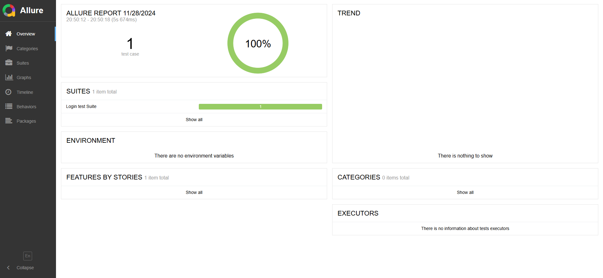
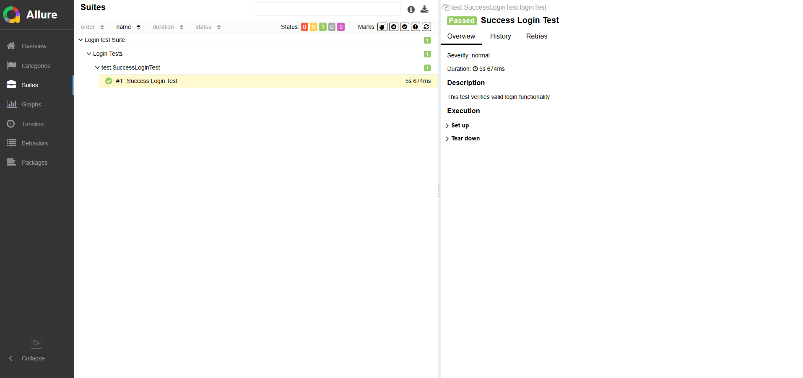

# Selenium Example Project


# Requirements
* Selenium 4.13.1
* Java 17
* Maven 3.9.2
* TestNG
* Allure Report 2.32.0

# Installation

## 1. Firstly clone the project

```
https://github.com/nursensinc/SeleniumExample.git
```

## 2. Then Install Java
* For Mac
```
https://www.oracle.com/java/technologies/downloads/#jdk17-mac 
```
* For Windows
```
https://www.oracle.com/java/technologies/downloads/#jdk17-windows 
```

#### If you are using Mac,enter the following commands in the terminal in order:
* nano .bash_profile
* export JAVA_HOME= your downloading path.
* export PATH=$PATH:$JAVA_HOME/bin

## 3. Then Install Maven

```
https://maven.apache.org/download.cgi
```
#### If you are using mac, enter the following commands in the terminal in order:
```
nano .bash_profile
```
```
export M2_HOME= your downloading path.
```
```
export PATH=$PATH:$M2_HOME/bin
```

# For Allure Report
* For Mac run this command in terminal
```
brew install allure
```
* For Windows run this command in terminal
```
scoop install allure
```

##### If don't have brew on your computer
* Run this command in terminal
```
/bin/bash -c "$(curl -fsSL https://raw.githubusercontent.com/Homebrew/install/HEAD/install.sh)"
```
* And run this command
  ```
  nano .bash_profile
  ```
* Add your profile this command
  ```
  export PATH=/opt/homebrew/bin:$PATH
  ```

##### If don't have scoop on your computer
* Run this command from a non-admin PowerShell
```
irm get.scoop.sh | iex
# You can use proxies if you have network trouble in accessing GitHub, e.g.
irm get.scoop.sh -Proxy 'http://<ip:port>' | iex
```

## Test Scenario Running
* Run the testng.xml file or execute the "mvn test" command from the terminal.

## Allure Report
* After the test run is completed, a file will be created under the reports directory in the format of yyyy-MM-dd_HH-mm.
* If you open the index.html file under this directory, you will be able to view the test report.


### Sample Report


